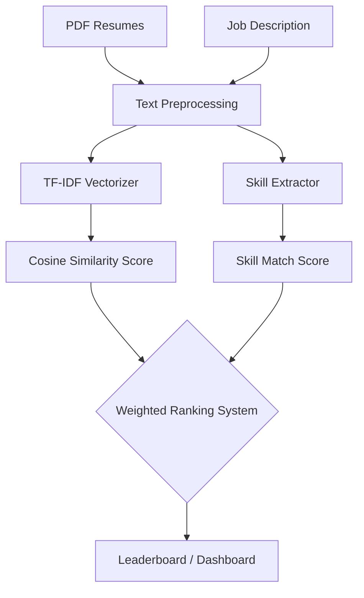

<div align="center">

# 🚀 AI-Powered Resume Screening System

[](https://www.python.org/)
[](https://streamlit.io)
[](https://opensource.org/licenses/MIT)

*An intelligent, fast, and accurate candidate ranking pipeline built with Machine Learning.*

[**Features**](#-features) • [**Quick Start**](#-quick-start) • [**How It Works**](#-how-it-works) • [**Web App**](#-web-app) • [**Contributing**](#-contributing)

</div>

---

## 🎯 What is this?
Finding the right candidate in a pile of hundreds of resumes is like finding a needle in a haystack. This **AI-Powered Resume Screening System** automates the tedious triage process. 

By combining **TF-IDF cosine similarity** with an intelligent **keyword-based skill extraction engine**, this system ranks candidates against your exact job description, saving HR professionals and recruiters countless hours.

---

## ✨ Features

- **📄 Intelligent Parsing**: Flawlessly extracts text from PDF resumes using `pdfplumber`.
- **🧠 Hybrid Scoring Engine**:
  - **70% Skill Match**: Detects over 50+ exact technical keywords across disciplines.
  - **30% Semantic Similarity**: Uses TF-IDF vectorization to measure the contextual fit between the resume and the job description.
- **📊 Interactive Dashboard**: A sleek, intuitive web application powered by **Streamlit**.
- **📈 Rich Visualizations**: View candidate radar charts, bar plots, and score distributions dynamically.
- **⚡ Batch Processing**: Evaluate dozens of resumes in seconds via the Command Line Interface (CLI) or Web UI.
- **💾 Export Ready**: Download screening results as CSV for ATS (Applicant Tracking System) integration.
- 


---

## 🛠️ Architecture



---

## 🚀 Quick Start

### 1. Prerequisites
Ensure you have **Python 3.10+** installed on your system.

### 2. Installation
Clone the repository and install the dependencies:
```bash
# Clone the repository
git clone https://github.com/your-username/resume-screening-ml.git
cd resume-screening-ml

# Create and activate a virtual environment
python -m venv venv
# On Windows:
venv\Scripts\activate
# On macOS/Linux:
source venv/bin/activate

# Install required packages
pip install -r requirements.txt
```

### 3. Usage: Web App (Recommended)
Launch the interactive Streamlit dashboard:
```bash
streamlit run app/app.py
```
*The app will automatically open in your default browser at `http://localhost:8501`.*

### 4. Usage: CLI Pipeline
Run the command-line scoring engine:
```bash
python main.py
```
*Outputs a ranked list of top candidates directly to your terminal.*

---

## 📂 Project Structure

```text
resume-screening-ml/
├── app/
│   └── app.py               # Streamlit web interface
├── data/
│   ├── INFORMATION-TECHNOLOGY/   # Resume corpus (PDFs)
│   └── job_descriptions.csv      # Job postings dataset
├── models/                  # Stored ML models/vectorizers
├── scripts/
│   └── generate_job_descriptions.py # Dataset generation tool
├── src/
│   ├── data_loader.py       # PDF/CSV loaders
│   ├── preprocess.py        # Text cleaning pipeline
│   ├── skill_extractor.py   # Skill matching engine 
│   ├── similarity.py        # TF-IDF logic
│   └── ranker.py            # Final scoring formula
├── utils/
│   └── visualization.py     # Matplotlib/Seaborn graph generation
├── main.py                  # CLI Entry point
└── requirements.txt         # Dependencies
```

---

## ⚙️ Configuration & Datasets

### Weights and Tuning
You can tweak the scoring weights directly in `main.py` or through the Web UI. Example configuration:
```python
# Default configuration
SKILL_WEIGHT = 0.70  # Prioritizes exact hard-skill matches
SIM_WEIGHT = 0.30    # Measures overall experience/context similarity
```

### Datasets
The primary data relies on two sources in the `data/` folder:
1. **Resumes**: PDF resumes placed inside `data/INFORMATION-TECHNOLOGY/`. (Included: 120 IT Resumes).
2. **Job Postings**: Structured in `data/job_descriptions.csv` containing at least `job title` and `job description`.

> **Tip**: You can easily swap these out for datasets from Kaggle (e.g., *LinkedIn Job Postings* or *Indeed Scraped Data*).

---

## 💻 Technology Stack

<p align="center">
  
  
  
  
</p>

* **Core**: Python 3.10+
* **ML & NLP**: `scikit-learn`, `nltk`
* **Data Processing**: `pandas`, `numpy`, `pdfplumber`
* **Visualization**: `matplotlib`, `seaborn`, `streamlit`

---

## 🤝 Contributing

Contributions are always welcome! Whether it's adding new skill dictionaries, tweaking the NLP pipeline, or improving the frontend:

1. Fork the Project
2. Create your Feature Branch (`git checkout -b feature/AmazingFeature`)
3. Commit your Changes (`git commit -m 'Add some AmazingFeature'`)
4. Push to the Branch (`git push origin feature/AmazingFeature`)
5. Open a Pull Request

---

## 📜 License

This project is for educational purposes. Distributed under the MIT License.

---
<div align="center">
  <i>Developed with ❤️ for smarter recruitment.</i>
</div>
